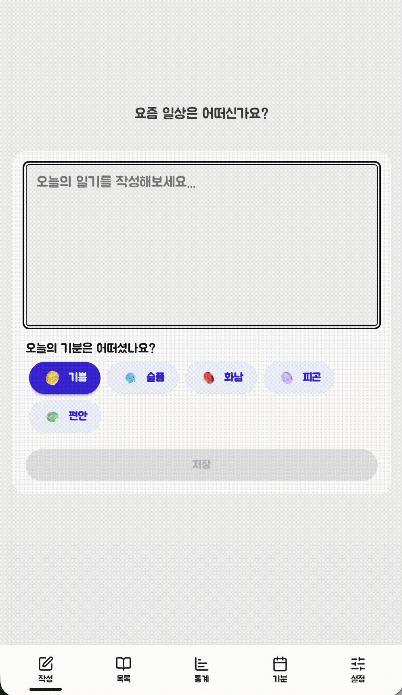
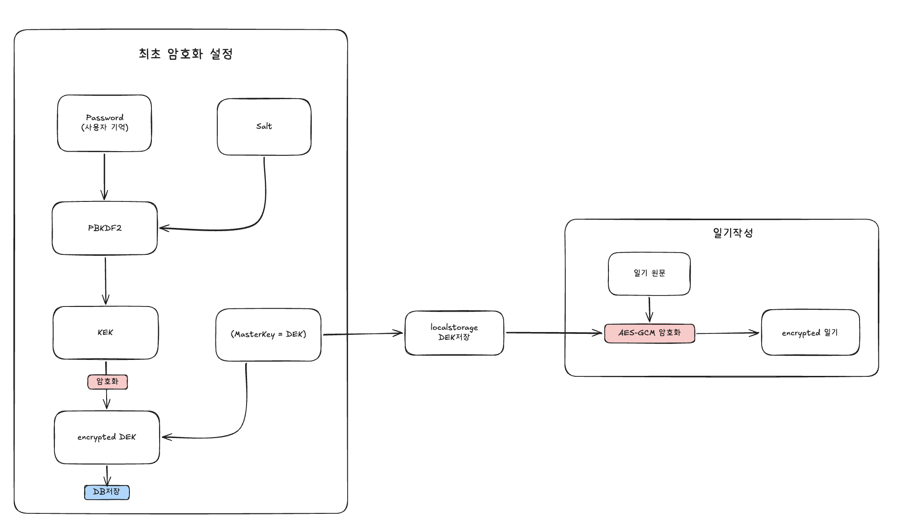
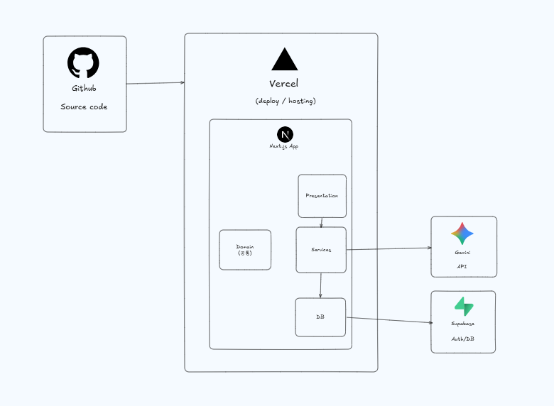

# Mindful Journal (마음챙김 일기)

> 종단간 암호화(E2EE)를 통해 누구도 열어볼 수 없는 안전한 공간에서 감정을 기록하고 돌아보는 일기 앱

 

  

 

## 주요 기능

- **가이드 질문 일기 작성** — 질문으로 글쓰기 유도
- **AI 공감 한마디** — 복호화된 본문을 Gemini로 전송, 응답도 암호화하여 저장
- **감정 통계** — 연속 기록, 평균 글자수, 감정 분포, 월별 추이
- **기분 캘린더** — 날짜별 기분 시각화

## 설계 및 기술적 특징

### 1. 보안 및 암호화

 
<a href="./docs/e2ee-architecture.png">E2EE 세부 동작 다이어그램 보기</a>

- **종단간 암호화 (E2EE)**
    - 모든 일기 데이터는 브라우저 환경에서 암호화된 후 서버로 전송됩니다. 데이터베이스에는 암호문만 저장되므로 서버 관리자도 원문을 읽을 수 없습니다.
- **DEK/KEK 엔벨로프(Envelope) 암호화 패턴**
    - 사용자의 비밀번호로 도출된 KEK(Key Encryption Key)로, 실제 데이터를 암호화하는 DEK(Data Encryption Key)를 암호화하여 보관합니다.
    - 이 구조를 통해 비밀번호를 변경할 때 기존에 작성한 일기 전체를 재암호화할 필요 없이, 암호화된 DEK만 갱신하여 처리 비용을 최소화했습니다.

### 2. 아키텍처

 

- **레이어드 아키텍처**
    - `Domain` / `Service` / `Repository` 계층으로 책임을 분리하여 뷰 레이어에서의 데이터베이스 직접 접근을 차단했습니다.
- **아토믹 디자인 (Atomic Design Pattern)**
    - UI 컴포넌트를 `Atom`, `Molecule`, `Organism` 단위로 나누어 설계했습니다.

## 기술 스택

| 분류           | 기술                      |
| -------------- | ------------------------- |
| Framework      | Next.js 16, React 19      |
| Language       | TypeScript                |
| Styling        | Tailwind CSS 4, DaisyUI 5 |
| Backend        | Supabase (Auth, Database) |
| AI             | Google Generative AI      |
| Testing        | Vitest, Playwright        |
| UI Development | Storybook                 |

